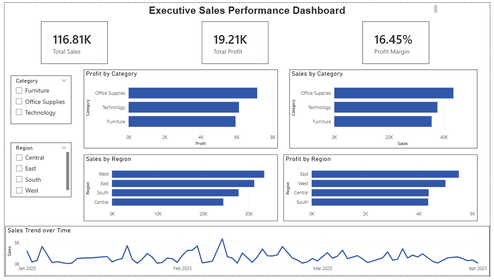

# 📊 Ecommerce Sales Analysis

## Dashboard Preview

## 📌 Project Overview
Interactive Power BI dashboard analyzing e-commerce sales, profit, and margin by category and region.

This project analyzes ecommerce transactional data using SQL and Power BI to evaluate sales performance, profitability, and product trends. The goal was to simulate a real-world business intelligence workflow by extracting key insights from raw sales data.

---

## 🛠 Tools Used
- SQL (SQLite)
- Power BI
- Excel / CSV

---

## 📈 Key Business Questions
- What is the total revenue and profit?
- Which categories drive the most sales?
- Which regions perform best?
- What products generate the highest revenue?
- Are any products operating at a loss?
- How do discounts impact profitability?

---

## 💰 Executive KPIs
Key metrics calculated using SQL:

- Total Revenue
- Total Profit
- Total Orders
- Average Order Value (AOV)
- Profit Margin (%)

---

## 🔎 SQL Analysis
SQL queries were used to aggregate and analyze business performance metrics, including:

- Revenue & Profit by Category
- Revenue by Region
- Top Products by Sales
- Loss-Making Products
- Discount Impact Analysis

All SQL queries are available in:

`sql_analysis.sql`

---

## 📊 Dashboard Insights
Power BI was used to visualize findings and create an executive-style dashboard highlighting:

- Sales & Profit by Category
- Regional Performance
- Revenue Trends
- Profitability Comparisons
- KPI Summary Cards

---

## 🚀 Key Insights
- Identified highest revenue-generating categories
- Determined most profitable product segments
- Detected products operating at a loss
- Evaluated discount impact on profitability
- Compared regional sales performance

---

## 📁 Repository Contents
- `ecommerce_sales.csv` → Dataset
- `sql_analysis.sql` → SQL Queries
- `dashboard.png` → Power BI Dashboard Screenshot

---

## ✅ Project Outcome
This project demonstrates end-to-end data analysis skills including SQL querying, business metric evaluation, and dashboard development. The workflow mirrors real-world analyst responsibilities involving data aggregation, KPI calculation, and performance reporting.

## Project Workflow

1. Performed exploratory data analysis in Excel to validate key sales metrics.
2. Wrote SQL queries to calculate revenue, profit, and margin by category and region.
3. Imported the data into Power BI for dashboard development.
4. Created DAX measures to track key performance indicators.
5. Designed an interactive dashboard to monitor ecommerce sales performance.
